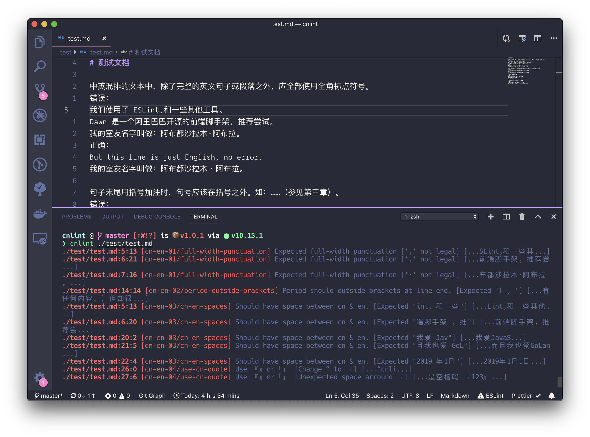

<h1 align="center">🚒 CNLint</h1>

<h3 align="center">Lint tool for markdown with Simplified Chinese and English.<br />中英文混合排版的 Markdown Lint 工具。</h3>

## Tutorial

Please see: [Markdown 简体中文与西文混排要点](https://www.yuque.com/jeason/box/ispdnv)

## Install

```sh
$ npm install -g cnlint
```

## Usage

```sh
$ cnlint -h
  Usage: cnlint [options] [command]
  
  Commands:
    help     Display help
    version  Display version
  
  Options:
    -d, --debug [value]  Show debug log (defaults to "false")
    -h, --help           Output usage information
    -r, --rule           Use local `**.js` file as new rule.
    -v, --version        Output the version number
  
  Examples:
    - Lint all markdown files pwd.
    $ cnlint ./**/*.md

    - Lint multiple markdown files.
    $ cnlint ./demo1.md ./demo2.md

    - Show debug logs when lint files.
    $ cnlint --debug=true ./example.md

    - Use local rule to lint. See: https://github.com/DavidAnson/markdownlint/blob/master/doc/CustomRules.md
    $ cnlint --rule=./my-rule.js
```



## License

[MIT](LICENSE)
